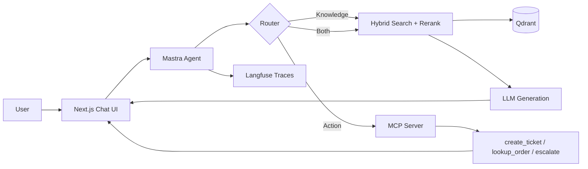

# Internal Knowledge Agent

A RAG-powered chat agent that answers questions from a company's internal docs **and** takes real actions (create ticket, look up order, escalate) via its own MCP server.

Built to demonstrate production-grade AI engineering: hybrid retrieval, reranking, citations, observability, and evals — not just a chatbot wrapper.

---

## What it does

Two capabilities, one agent:

| Capability | Input | Output |
|------------|-------|--------|
| **Knowledge** | "What's your refund policy?" | Streamed answer with citations to exact source docs |
| **Action** | "Create a ticket for my broken order #1234" | MCP tool call + visible result in chat |

The agent decides per message whether to retrieve, call a tool, or both. **That routing judgment — not the UI — is the core engineering problem.**

---

## Why this project

- **MCP is the current standard** in the agent ecosystem — almost no portfolio projects have a real MCP server.
- **Mirrors production vertical AI** — docs in, structured answers and actions out (legal AI, support AI, workflow AI).
- **Depth is immediately visible** — retrieval quality, citation accuracy, eval pass rate, and trace visibility separate tutorial-followers from engineers.

---

## Architecture



---

## Tech stack

| Layer | Choice | Role |
|-------|--------|------|
| Monorepo | Turborepo | Shared types/schemas across agent, ingestion, eval, apps |
| Frontend | Next.js (App Router) | Streaming chat UI, citation chips, tool indicators |
| AI SDK | Vercel AI SDK | Streaming, tool calling, Zod structured outputs |
| Orchestration | Mastra | TypeScript-native, built-in MCP support |
| Vector DB | Qdrant | Hybrid search (BM25 + vector), self-hostable |
| Embeddings | Voyage `voyage-3` or OpenAI `text-embedding-3-large` | Document + query embeddings |
| Reranker | Voyage `rerank-2` | Critical step most RAG tutorials skip |
| Relational DB | PostgreSQL + Prisma | Chat history, ticket records, eval results |
| Actions | Custom MCP server | Pluggable into any MCP client |
| Observability | Langfuse / Langfuse-style via Langfuse | Traces every retrieval, rerank, tool call, generation |
| Evaluation | promptfoo | Retrieval + answer + tool-selection scoring |
| Deployment | Vercel (web) + Railway/Fly.io (MCP, Qdrant, Postgres) | No k8s required |

No Docker/Kubernetes/Helm in production. Docker for local Qdrant only.

---

## Build phases

| Phase | Focus | Exit criteria |
|-------|-------|---------------|
| **1** | Ingestion + retrieval core | 5–10 manual queries return correct chunks |
| **2** | RAG answer pipeline | Streamed answers with clickable citations |
| **3** | MCP server + agent routing | Action questions trigger correct tool calls |
| **4** | Observability + evals | Langfuse traces; promptfoo pass rate |
| **5** | Polish + documentation | Demo-ready UI; five docs accurate; 30–60s demo |
| **6** *(later)* | Paid tier (Dodo Payments) | Only after Phases 1–5 are solid |

See [docs/knowledge-agent/PHASES.md](./docs/knowledge-agent/PHASES.md) for step-by-step details.

---

## Repository structure

**Target layout** (work toward this):

```
├── apps/
│   ├── web/                    # Next.js chat UI
│   │   ├── app/api/chat/       # streaming chat endpoint
│   │   └── components/         # chat, citation, tool-call-indicator
│   └── mcp-server/             # standalone MCP server
│       └── src/tools/          # create-ticket, lookup-order, escalate
├── packages/
│   ├── agent/                  # Mastra agent + router + retrieval
│   ├── ingestion/              # parse → chunk → embed → Qdrant upsert
│   ├── eval/                   # promptfoo test suite
│   └── shared/                 # Zod schemas, Prisma client
└── docs/knowledge-agent/       # project documentation
```

**Current repo** (scaffold — pre–Phase 1):

| Path | Status | Notes |
|------|--------|-------|
| `apps/frontend` | Exists | Next.js app; auth UI today → becomes chat UI |
| `apps/api` | Exists | Express stub with session middleware → not MCP yet |
| `packages/database` (`@repo/db`) | Exists | Prisma + Postgres (auth models) → grows into `shared` |
| `packages/agent` | Not started | Phase 2–3 |
| `packages/ingestion` | Not started | Phase 1 |
| `packages/eval` | Not started | Phase 4 |
| `apps/mcp-server` | Not started | Phase 3 |

---

## Key design decisions

- **Mastra over LangGraph** — TypeScript-native, built-in MCP, faster to ship solo.
- **Hybrid search, not pure vector** — BM25 catches IDs and error codes; vectors catch paraphrase; rerank on top.
- **MCP server as its own app** — real protocol demo; pluggable into Claude Desktop or any MCP client.
- **Mocked tool backends are fine** — schemas, auth boundaries, and tool-selection matter more than a real ticketing system.

---

## Documentation

| File | Purpose |
|------|---------|
| [PROJECT_SPEC.md](./docs/knowledge-agent/PROJECT_SPEC.md) | Full build brief — hand to Cursor as project context |
| [README.md](./docs/knowledge-agent/README.md) | Doc index + overview |
| [ARCHITECTURE.md](./docs/knowledge-agent/ARCHITECTURE.md) | Data flow, routing, design rationale |
| [PHASES.md](./docs/knowledge-agent/PHASES.md) | Phase-by-phase tasks and verification gates |
| [SETUP.md](./docs/knowledge-agent/SETUP.md) | Env vars, local dev, seeding Qdrant, running evals |
| [MCP_TOOLS.md](./docs/knowledge-agent/MCP_TOOLS.md) | Tool schemas, examples, when-to-call |
| [EVAL.md](./docs/knowledge-agent/EVAL.md) | Eval methodology, test cases, pass rate |
| [TECH_STACK.md](./docs/knowledge-agent/TECH_STACK.md) | Why each technology was chosen |

A reviewer should read **README.md** + **EVAL.md** and understand the project in under three minutes.

---

## What "done" looks like

- [ ] Knowledge question → streamed answer with real, clickable citations
- [ ] Action question → agent calls the correct MCP tool; UI shows call + result
- [ ] Langfuse trace for every chat turn (retrieval → rerank → tool → generation)
- [ ] `npm run eval` runs promptfoo and prints a pass rate
- [ ] Five markdown docs accurate to what's built
- [ ] 30–60 second demo: one knowledge question + one action question

---

## Quickstart

```bash
npm install
npm run dev          # starts current apps (frontend + api)
```

Full setup (Qdrant, ingestion, env vars): [docs/knowledge-agent/SETUP.md](./docs/knowledge-agent/SETUP.md)

Build order: [docs/knowledge-agent/PHASES.md](./docs/knowledge-agent/PHASES.md)
