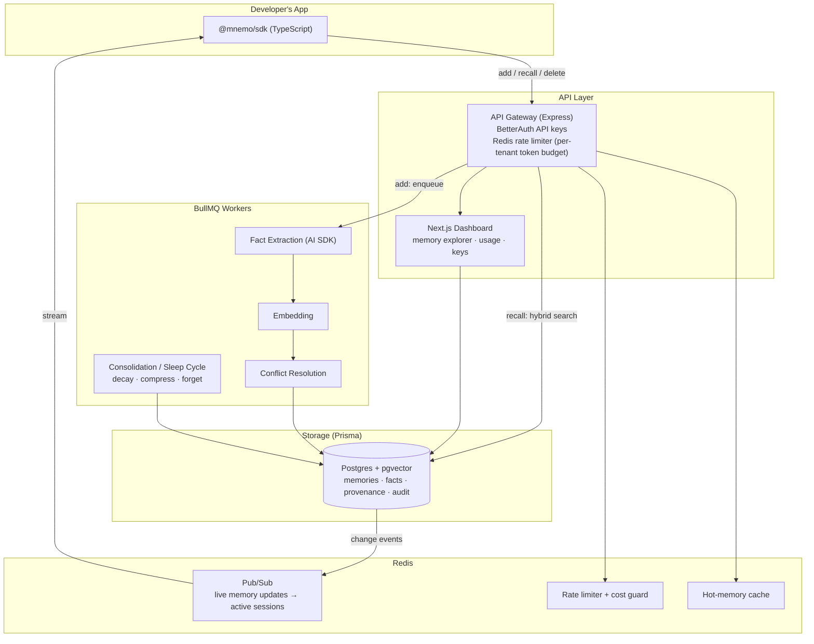
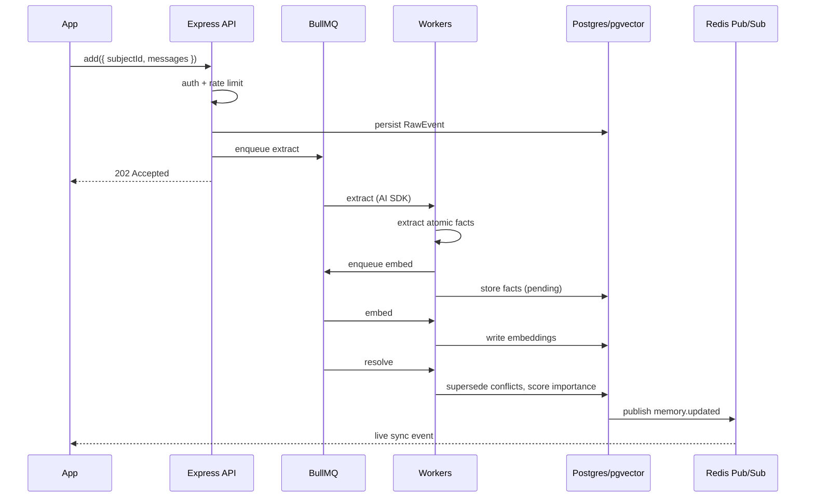
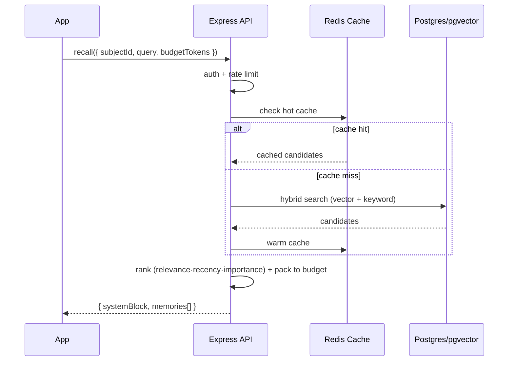

# 02 — System Architecture

## 1. Design principle

**Writes are async; reads are sync.**

- `add()` enqueues work (extraction, embedding, resolution, consolidation) onto BullMQ and returns immediately. Heavy AI work happens off the request path.
- `recall()` runs a fast hybrid query against Postgres/pgvector (+ Redis hot cache) and returns synchronously within a token budget.

This split is *why* BullMQ + Redis are core to the stack, not decoration.

---

## 2. System diagram

---

## 3. Components

### 3.1 API Gateway (Express)
- Verifies BetterAuth API keys, resolves tenant.
- Enforces Redis rate limiter and per-tenant token/cost budget.
- Routes: `add`, `recall`, `delete`, `keys`, `webhooks`.
- On `add`: validate → persist raw event → enqueue extraction job → return `202`.
- On `recall`: run hybrid retrieval → assemble context block within budget → return.

### 3.2 Next.js Dashboard
- Memory explorer (the demo money-shot): browse a subject's memories, see provenance, one-click delete.
- Usage & cost analytics, API-key management, billing.

### 3.3 BullMQ Workers
| Worker | Job |
|---|---|
| `extract` | LLM extracts atomic facts from raw events (AI SDK) |
| `embed` | Generates vector embeddings for facts |
| `resolve` | Detects conflicts, builds supersede chains, updates importance |
| `consolidate` | Scheduled "sleep cycles": decay scores, compress old episodics, forget noise |

### 3.4 Redis
- **Pub/Sub:** broadcasts memory change events so live sessions stay in sync (the cross-app demo).
- **Rate limiter / cost guard:** per-tenant token-bucket; caps embedding + extraction spend.
- **Hot cache:** recently recalled memories per subject for low-latency reads.

### 3.5 Storage (Postgres + pgvector via Prisma)
- `Memory`, `RawEvent`, `AuditLog`, `Tenant`, `ApiKey`, `Subject`.
- pgvector for embeddings; GIN/tsvector for keyword search (hybrid). See [`04-DATA-MODEL.md`](04-DATA-MODEL.md).

---

## 4. Write path (sequence)

---

## 5. Read path (sequence)

---

## 6. Multi-tenancy & isolation
- Every row is scoped by `tenantId`; all queries are tenant-filtered at the service layer.
- API keys map to a tenant via BetterAuth; rate limits and budgets are per-tenant in Redis.
- Optional dedicated/self-host deployment for enterprise (governance tier).

---

## 7. Scaling notes
- API and workers scale independently (workers scale with ingest volume).
- pgvector with IVFFlat/HNSW index; partition `Memory` by tenant at scale.
- Consolidation runs as scheduled/cron BullMQ jobs to keep stores lean and retrieval fast.
- Redis cache + budget caps keep p99 read latency and CoGS predictable.
