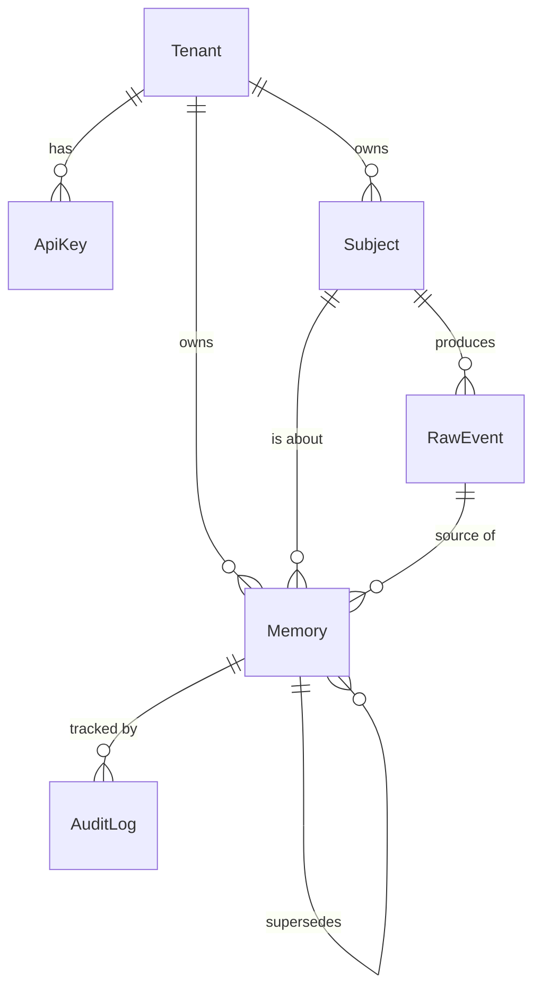

# 04 — Data Model

> Reference schema for Phase 1 documentation. No migrations are run yet.

## 1. Entity overview



- **Tenant** — a customer (developer/company) using Mnemo.
- **Subject** — the end-user a memory is *about* (portable across the tenant's apps).
- **RawEvent** — the original ingested payload (messages); source for provenance.
- **Memory** — an atomic, scored, embedded unit of memory.
- **AuditLog** — every access/delete/redaction for governance.
- **ApiKey** — per-tenant credentials (BetterAuth).

---

## 2. Memory types

| Type | Description | Example |
|---|---|---|
| `EPISODIC` | Specific events/conversations | "On May 3 the user reported a billing bug" |
| `SEMANTIC` | Durable facts/preferences | "User is vegetarian" |
| `PROCEDURAL` | Learned workflows/how-to | "Deploy = run CI then approve" |
| `WORKING` | Short-term, high-decay scratch | "Currently debugging checkout flow" |

---

## 3. Prisma schema (reference)

```prisma
generator client {
  provider = "prisma-client-js"
}

datasource db {
  provider   = "postgresql"
  url        = env("DATABASE_URL")
  extensions = [vector]   // pgvector
}

enum MemoryType {
  EPISODIC
  SEMANTIC
  PROCEDURAL
  WORKING
}

enum MemoryStatus {
  PENDING      // extracted, awaiting embed/resolve
  ACTIVE
  SUPERSEDED   // replaced by a newer memory
  FORGOTTEN    // decayed/consolidated away
  DELETED      // explicit user deletion (kept as tombstone in audit)
}

model Tenant {
  id        String   @id @default(cuid())
  name      String
  plan      String   @default("free")
  createdAt DateTime @default(now())

  apiKeys   ApiKey[]
  subjects  Subject[]
  memories  Memory[]
  rawEvents RawEvent[]
}

model ApiKey {
  id         String   @id @default(cuid())
  tenantId   String
  hashedKey  String   @unique
  label      String?
  lastUsedAt DateTime?
  createdAt  DateTime @default(now())
  tenant     Tenant   @relation(fields: [tenantId], references: [id])

  @@index([tenantId])
}

model Subject {
  id         String   @id @default(cuid())
  tenantId   String
  externalId String   // the tenant's user id; enables cross-app portability
  createdAt  DateTime @default(now())
  tenant     Tenant   @relation(fields: [tenantId], references: [id])

  memories   Memory[]
  rawEvents  RawEvent[]

  @@unique([tenantId, externalId])
  @@index([tenantId])
}

model RawEvent {
  id         String   @id @default(cuid())
  tenantId   String
  subjectId  String
  payload    Json     // original messages/event
  source     String?  // app/channel identifier
  createdAt  DateTime @default(now())

  tenant     Tenant   @relation(fields: [tenantId], references: [id])
  subject    Subject  @relation(fields: [subjectId], references: [id])
  memories   Memory[]

  @@index([tenantId, subjectId])
}

model Memory {
  id          String       @id @default(cuid())
  tenantId    String
  subjectId   String
  sourceEventId String?

  type        MemoryType
  status      MemoryStatus @default(PENDING)
  content     String                                   // the atomic fact
  embedding   Unsupported("vector(1536)")?
  keywords    Unsupported("tsvector")?                 // hybrid keyword search

  importance  Float        @default(0.5)               // 0..1
  decayRate   Float        @default(0.1)               // higher = forgets faster
  confidence  Float        @default(0.8)               // extractor confidence

  supersedesId String?                                  // conflict-resolution chain
  provenance  Json                                      // {eventIds, model, spans}

  lastUsedAt  DateTime?
  usageCount  Int          @default(0)
  createdAt   DateTime     @default(now())
  updatedAt   DateTime     @updatedAt

  tenant      Tenant       @relation(fields: [tenantId], references: [id])
  subject     Subject      @relation(fields: [subjectId], references: [id])
  sourceEvent RawEvent?    @relation(fields: [sourceEventId], references: [id])
  supersedes  Memory?      @relation("Supersede", fields: [supersedesId], references: [id])
  supersededBy Memory[]    @relation("Supersede")
  auditLogs   AuditLog[]

  @@index([tenantId, subjectId, type, status])
  @@index([tenantId, subjectId, lastUsedAt])
}

model AuditLog {
  id        String   @id @default(cuid())
  memoryId  String
  tenantId  String
  action    String   // CREATED | READ | UPDATED | SUPERSEDED | REDACTED | DELETED
  actor     String   // api-key id / dashboard user
  metadata  Json?
  createdAt DateTime @default(now())

  memory    Memory   @relation(fields: [memoryId], references: [id])

  @@index([tenantId, memoryId])
}
```

> Note: `Unsupported("vector(1536)")` and `tsvector` reflect pgvector / full-text columns managed via raw SQL in migrations. Index choice (IVFFlat vs HNSW) is decided at implementation time.

---

## 4. Provenance & governance

- Every `Memory` stores `provenance` (which `RawEvent`/message spans + which model produced it). This answers *"why do you believe this?"*
- `AuditLog` records every lifecycle action — required for the governance tier (GDPR/SOC2 story).
- Deletion is a **tombstone**: the memory is removed from retrieval but a `DELETED` audit entry persists to *prove* deletion happened.

---

## 5. Portability mechanism

`Subject.externalId` is the tenant's own user id. Any of the tenant's apps that call `add`/`recall` with the same `externalId` read/write the **same** memory set — this is the cross-app portability that distinguishes Mnemo.
