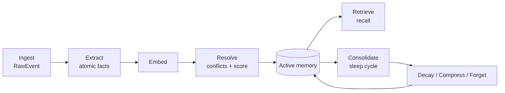
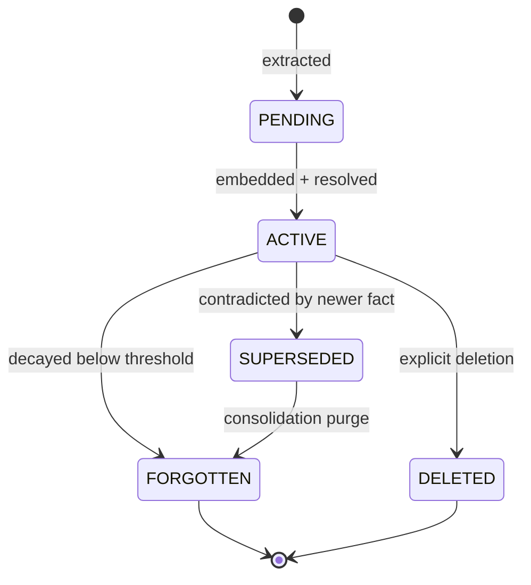

# 05 — Memory Lifecycle

The lifecycle is what makes Mnemo *self-maintaining* — the differentiator mem0/Letta lack. Each stage runs as a BullMQ job (except retrieval, which is synchronous).



---

## 1. Ingest
- `add()` writes a `RawEvent` and enqueues `extract`.
- Returns `202` immediately. The raw payload is the provenance anchor.

## 2. Extract (AI SDK)
- An LLM extracts **atomic facts** from the event ("user is vegetarian", "prefers TypeScript").
- Each fact gets: `type` (episodic/semantic/procedural/working), `confidence`, and span pointers back to the source for provenance.
- Output is small, normalized statements — not raw transcript chunks.

## 3. Embed
- Each fact is embedded (vector) and gets a `tsvector` for keyword search → enables hybrid retrieval.

## 4. Resolve (conflict resolution)
The signature step. New facts are checked against existing memory for the same subject:

| Situation | Action |
|---|---|
| New fact duplicates existing | Merge, bump `importance`, update `usageCount` |
| New fact contradicts existing | Create new `ACTIVE` memory, set old → `SUPERSEDED`, link via `supersedesId` |
| New fact is unrelated | Insert as new memory |

This builds an auditable **supersede chain** ("user *was* vegan → now vegetarian"), instead of silently overwriting or duplicating.

## 5. Scoring: importance & decay
Each memory carries:
- `importance ∈ [0,1]` — how central this fact is (set by extractor, boosted by usage).
- `decayRate` — how fast it loses relevance over time (working memory decays fast; semantic facts slowly).

A time-aware **effective score** drives both retrieval ranking and forgetting:

```
effectiveScore = importance * exp(-decayRate * ageDays)
                 + recencyBoost(lastUsedAt)
                 + usageBoost(usageCount)
```

## 6. Consolidate (the "sleep cycle")
A scheduled BullMQ repeatable job per tenant/subject that keeps the store lean and retrieval high-quality:

1. **Decay** — recompute effective scores; demote stale memories.
2. **Compress** — summarize clusters of related episodic memories into fewer semantic memories (e.g. 20 support chats → "user frequently asks about billing").
3. **Forget** — memories below a forget-threshold move to `FORGOTTEN` (removed from retrieval, retained briefly for audit, then purged).
4. **Reinforce** — frequently recalled memories get importance boosts (use it or lose it).

> Analogy used in pitches: Mnemo "sleeps" and consolidates memories the way a brain does — short-term noise is discarded, important patterns are strengthened.

## 7. Retrieve
Synchronous; see [`06-RAG-RETRIEVAL.md`](06-RAG-RETRIEVAL.md). Retrieval reads `ACTIVE` memories ranked by `effectiveScore` + query relevance, packed into a token budget.

## 8. Govern (delete / redact)
- `delete(memoryId)` or `forget({ subjectId, filter })` → status `DELETED`, emits `AuditLog`, publishes a pub/sub event so live sessions drop it.
- PII redaction can run at extraction (mask before store) or on demand.
- Tombstones prove deletion for compliance.

---

## State machine


