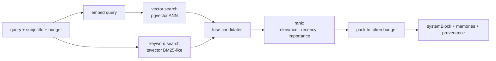

# 06 — RAG & Retrieval

In nmemo, **RAG is the read path of memory**. `recall()` is a retrieval-augmented step that assembles the most relevant memories into a context block for the caller's LLM. What makes it different from generic RAG: retrieval is **personalized** (per-subject importance + recency) and **governed** (every result carries provenance).

---

## 1. Retrieval pipeline



## 2. Hybrid candidate generation
- **Vector search:** embed the query, ANN search over `Memory.embedding` (pgvector). Captures semantic similarity.
- **Keyword search:** `tsvector` match for exact terms, names, IDs that embeddings miss.
- **Fusion:** combine with Reciprocal Rank Fusion (RRF) to merge both candidate lists robustly.

## 3. Ranking (the secret sauce)
Candidates are re-scored with a blended function — not pure cosine similarity:

```
score(m) =  w_rel * relevance(query, m)         // hybrid similarity
          + w_imp * importance(m)               // how central the fact is
          + w_rec * recency(m.lastUsedAt)       // freshness
          + w_use * usageBoost(m.usageCount)    // reinforced memories
          - w_dec * decayPenalty(m)             // stale/low-value
```

- Weights are tunable per tenant and per memory type (e.g. semantic facts weight importance higher; working memory weights recency higher).
- This is *why retrieval improves over time*: as consolidation reinforces useful memories and forgets noise, ranking quality rises.

## 4. Budget packing
- Caller passes `budgetTokens`. nmemo greedily packs the highest-scoring memories until the budget is hit.
- Optionally compresses overflow into a short summary line ("+ 12 older preferences").
- Returns a ready-to-use `systemBlock` string plus the structured `memories[]` (with provenance) for callers who want to render citations.

## 5. Response shape
```ts
{
  systemBlock: string,          // drop straight into the prompt
  memories: Array<{
    id: string,
    type: MemoryType,
    content: string,
    score: number,
    provenance: { eventIds: string[], model: string }
  }>,
  budget: { used: number, limit: number }
}
```

## 6. Caching
- Redis caches recent `(subjectId, queryHash)` candidate sets for low-latency repeat reads.
- Cache is invalidated on `memory.updated` / `memory.deleted` pub/sub events for that subject.

## 7. Roadmap: RAG-as-a-service (expansion)
The same retrieval engine generalizes from *memories* to *arbitrary documents*. A future product line lets tenants ingest docs/knowledge bases and query them through the same governed, ranked retrieval — a natural land-and-expand from memory into full RAG infrastructure. See [`09-ROADMAP.md`](09-ROADMAP.md).
