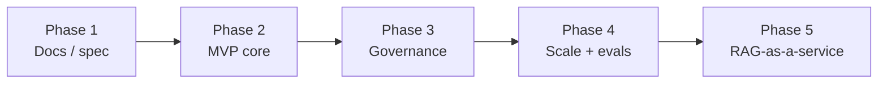

# 09 — Roadmap

## 1. Two-week MVP (demo-ready for interviews)

Goal: a working slice that proves the 3 pillars and nails the 60-second cross-app demo.

| Days | Deliverable |
|---|---|
| **1–4** | Express API (`add`/`recall`), BetterAuth API keys, Prisma + Postgres + pgvector, basic vector retrieval |
| **5–8** | BullMQ extraction worker (AI SDK), embedding, conflict resolution + importance scoring |
| **9–11** | Consolidation job + decay; Redis rate limiter + pub/sub live sync |
| **12–14** | Next.js dashboard with **memory explorer** + cross-app shared-memory demo |

**Demo definition of done:** tell app A "I'm allergic to peanuts" → app B already knows; dashboard shows the fact, its provenance, and one-click delete that propagates instantly.

---

## 2. Phased roadmap

### Phase 1 — Documentation (current)
- Product, architecture, data model, lifecycle, RAG, API, business, roadmap. **No code.**

### Phase 2 — MVP core
- The 2-week build above. Self-serve Free + Pro.

### Phase 3 — Governance
- Audit export, PII redaction pipeline, per-memory delete propagation, GDPR subject export.
- Begins SOC2 readiness → unlocks Enterprise tier.

### Phase 4 — Scale & quality
- Memory **evals**: quality scoring + regression detection.
- Tunable ranking weights per tenant/type; analytics dashboards.
- pgvector HNSW indexing, partitioning; autoscaled workers.

### Phase 5 — RAG-as-a-service (expansion)
- Generalize the retrieval engine from memories to arbitrary documents.
- Same governed, ranked, metered retrieval — land-and-expand into full RAG infra.

---

## 3. Out of scope (for now)
- Agent framework features (we integrate, not replace).
- General-purpose vector DB use cases.
- End-user chat product.

---

## 4. Risks & mitigations
| Risk | Mitigation |
|---|---|
| Extraction quality varies by model | AI SDK provider abstraction; eval harness in Phase 4 |
| Retrieval relevance tuning | Hybrid + tunable weights; consolidation feedback loop |
| Cost blowups | Per-tenant token budget / rate limiter (margin protection) |
| Competition from mem0/Letta | Lead with governance + portability wedge |
| Vendor model lock-in | Provider-neutral AI SDK layer |

---

## 5. Definition of "fundable demo"
1. Cross-app memory portability shown live.
2. Provenance + one-click governance shown in dashboard.
3. A graph/metric showing retrieval quality improving as consolidation runs.
4. A short unit-economics slide (capped CoGS, NRR > 120%).
