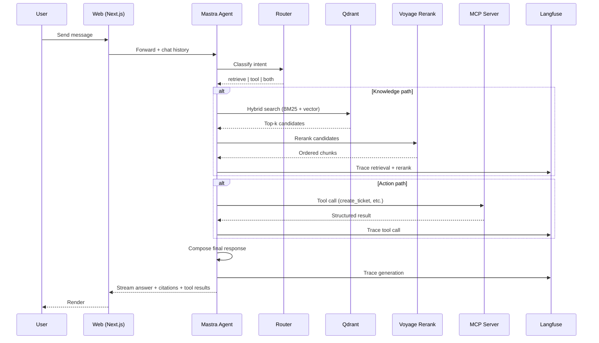

# Architecture

Deep dive into data flow, routing decisions, and the engineering choices behind the Internal Knowledge Agent.

---

## System overview

The agent sits between the chat UI and two backends:

1. **Qdrant** — document chunks for knowledge retrieval
2. **MCP server** — action tools for operational tasks

A **router** decides which path (or both) each user message needs. The UI only renders; the routing judgment is the core problem.



---

## Why hybrid search, not pure vector

| Approach | Strength | Weakness |
|----------|----------|----------|
| Vector only | Semantic similarity, paraphrase matching | Blurs exact terms (IDs, error codes, SKUs) |
| BM25 only | Exact keyword matches | Misses paraphrased questions |
| **Hybrid + rerank** | Best of both, reranker picks winners | Slightly more infra — worth it |

Production RAG systems almost always combine keyword + dense retrieval, then rerank. Pure vector search is a tutorial shortcut.

### Retrieval pipeline

```
User query
  → Embed query (Voyage voyage-3)
  → Qdrant: parallel BM25 + vector search
  → Merge + deduplicate (top ~20–50 candidates)
  → Voyage rerank-2 (top 5–10)
  → Pass to LLM with citation instructions
```

---

## Why Mastra over LangGraph

| Criterion | Mastra | LangGraph |
|-----------|--------|-----------|
| Language | TypeScript-native | Python-first (TS exists but less mature) |
| MCP support | Built-in | Requires custom wiring |
| Time to ship solo | Days | Weeks for equivalent setup |
| Learning curve | Lower for TS monorepo | Higher for graph state machines |

Mastra was chosen for speed and first-class MCP. LangGraph is powerful for complex multi-agent graphs but overkill for this two-path router.

---

## Router design

`packages/agent/router.ts` classifies each message into one of three modes:

### 1. Retrieve only

**Signals:** factual questions, policy lookups, "how do I…", "what is…"

**Flow:** hybrid search → rerank → generate answer with citations

### 2. Tool only

**Signals:** imperative verbs ("create", "escalate", "look up order"), entity IDs without question context

**Flow:** select MCP tool → execute → format result for user

### 3. Both

**Signals:** "My order #1234 is late, what's the refund policy and can you escalate?"

**Flow:** retrieve relevant policy chunks first → then call `escalate_to_human` or `create_ticket` with enriched context

### Routing implementation options

- **LLM classification** — fast to build, good enough for demo; trace the classification in Langfuse
- **Heuristic + LLM fallback** — regex for order IDs / ticket keywords, LLM for ambiguous cases
- **Single agent with tools** — Mastra agent sees retrieval as a tool + MCP tools; model decides (simplest, slightly less control)

Recommended for Phase 3: Mastra agent with retrieval tool + MCP tools, with explicit Langfuse spans per decision.

---

## Structured answer contract

All knowledge responses conform to a Zod schema in `packages/shared`:

```ts
{
  answer: string,
  citations: Array<{
    source_url: string,
    title: string,
    snippet: string
  }>
}
```

Rules:

- Every factual claim in `answer` must have a matching citation
- `snippet` is the exact chunk text used — not paraphrased
- UI renders citations as clickable chips linking to `source_url`

---

## MCP server as standalone app

`apps/mcp-server` runs independently from `apps/web`. This is intentional:

- Demonstrates real MCP protocol compliance
- Pluggable into Claude Desktop, Cursor, or any MCP client
- Clear auth boundary between chat UI and action layer
- Mock backends are fine — the protocol and tool-selection matter, not a real ticketing system

See [MCP_TOOLS.md](./MCP_TOOLS.md) for tool specifications.

---

## Data stores

| Store | Contents | Access pattern |
|-------|----------|----------------|
| Qdrant | Document chunks + embeddings + metadata | Read-heavy (retrieval), write-once (ingestion) |
| PostgreSQL | Chat history, ticket records, eval results | Read/write per session |
| Langfuse | Traces, spans, scores | Write per turn, read for debugging |

---

## Observability model

Every chat turn produces one Langfuse trace with child spans:

```
trace: chat-turn-{id}
├── span: router-classification
├── span: hybrid-retrieval (query, candidate count, latency)
├── span: rerank (input count, output order)
├── span: tool-call-{name} (args, result)     [if action]
└── span: generation (model, tokens, output schema valid?)
```

This makes debugging retrieval misses vs. generation hallucinations vs. wrong tool selection straightforward.

---

## Deployment topology

```
Vercel          → apps/web (Next.js)
Railway/Fly.io  → apps/mcp-server
Railway/Fly.io  → Qdrant
Railway/Fly.io  → PostgreSQL
Langfuse Cloud  → observability (or self-hosted)
```

No Docker/Kubernetes in production. Docker for local Qdrant only.

---

## Current repo vs target

| Target | Current | Notes |
|--------|---------|-------|
| `apps/web` | `apps/frontend` | Evolve into chat UI (Phase 2) |
| `apps/mcp-server` | `apps/api` (Express stub) | Replace in Phase 3 |
| `packages/shared` | `packages/database` | Prisma here today; add Zod schemas in Phase 2 |

The Better Auth scaffold in `apps/frontend` is optional — the agent, retrieval, and MCP layers are the product core.
