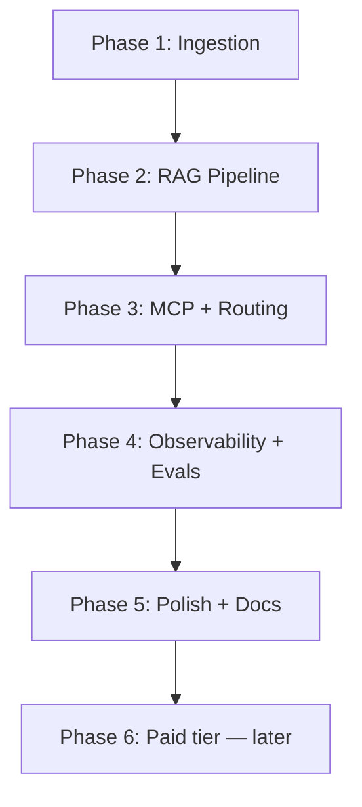

# Build Phases

Step-by-step build brief for the Internal Knowledge Agent. Work through phases in order — each has a verification gate before moving on.

**Canonical spec:** [PROJECT_SPEC.md](./PROJECT_SPEC.md)

---

## Phase 1 — Ingestion + retrieval core

**Goal:** Documents in Qdrant; manual retrieval sanity check passes.

### Tasks

1. Pick corpus: public SaaS help docs (Linear, Stripe, etc.) — ~80–150 articles
2. Create `packages/ingestion`:
   - `parse.ts` — PDF / HTML / MD parsing
   - `chunk.ts` — 500–800 tokens, 10–15% overlap
   - `embed.ts` — Voyage `voyage-3` or OpenAI `text-embedding-3-large`
   - `run.ts` — CLI entrypoint
3. Upsert to Qdrant with metadata: `source_url`, `title`, `section`, `chunk_index`
4. Stand up Qdrant locally (Docker for dev only)

### Verification gate

Run 5–10 hand-picked queries. Eyeball whether the right chunks come back. **Do not proceed until this passes.**

### Cursor rule

`.cursor/rules/knowledge-agent-ingestion.mdc`

---

## Phase 2 — RAG answer pipeline

**Goal:** Streamed answers with real, clickable citations.

### Tasks

1. Create `packages/agent/retrieval.ts`:
   - Hybrid search (BM25 + vector) against Qdrant
   - Rerank top-k with Voyage `rerank-2`
2. Define Zod schema in `packages/shared`: `{ answer, citations[{ source_url, title, snippet }] }`
3. Wire into `apps/web/app/api/chat/route.ts` via Vercel AI SDK (`streamObject` or `streamText`)
4. Build UI components in `apps/web/components/`:
   - `citation.tsx` — clickable source chips
   - `chat.tsx` — streaming message list

> **Current repo:** evolve `apps/frontend` toward `apps/web`; add `/api/chat` route.

### Verification gate

Ask 3 knowledge questions in the UI. Each answer must:
- Stream tokens live
- Include at least one citation
- Citation links to the correct source doc

### Cursor rules

`.cursor/rules/knowledge-agent-retrieval.mdc`, `.cursor/rules/knowledge-agent-web.mdc`

---

## Phase 3 — MCP server + agent routing

**Goal:** Action questions trigger the correct MCP tool; UI shows the call.

### Tasks

1. Create `apps/mcp-server` with 3 tools (mock backends):
   - `create_ticket(subject, description, priority)`
   - `lookup_order_status(order_id)`
   - `escalate_to_human(reason)`
2. Create `packages/agent/router.ts` — decide retrieve / tool / both per message
3. Connect Mastra agent to MCP server + retrieval
4. Build `tool-call-indicator.tsx` — visible tool call + result in chat

> **Current repo:** `apps/api` is an Express stub — replace or rename when building MCP server. Do not embed MCP tools inside the web app.

### Verification gate

Test these prompts:
- "Create a ticket for my broken order" → `create_ticket` called, ticket ID shown
- "What's the status of order ORD-1234?" → `lookup_order_status` called
- "I need to speak to a manager" → `escalate_to_human` called

### Cursor rule

`.cursor/rules/knowledge-agent-mcp.mdc`

---

## Phase 4 — Observability + evaluation

**Goal:** Langfuse traces for every turn; promptfoo suite with pass rate.

### Tasks

1. Add Langfuse tracing around:
   - Retrieval call
   - Rerank call
   - Tool calls
   - Final generation
2. Create `packages/eval/testcases/` with 15–20 cases:
   - Retrieval accuracy (expected source doc)
   - Answer correctness (expected characteristics)
   - Tool selection (expected tool call)
3. Wire `npm run eval` to run promptfoo and print pass rate
4. Log pass rate and failure modes in [EVAL.md](./EVAL.md)

### Verification gate

- Pick any chat turn → find full trace in Langfuse (retrieval → rerank → generation)
- Run `npm run eval` → pass rate printed
- At least 15 test cases exist

### Cursor rule

`.cursor/rules/knowledge-agent-eval.mdc`

---

## Phase 5 — Polish + documentation

**Goal:** Demo-ready UI and accurate docs.

### Tasks

1. Polish chat UI: streaming, citation chips, tool-call indicators, error states
2. Ensure all five docs are accurate:
   - [README.md](../../README.md) (repo root)
   - [ARCHITECTURE.md](./ARCHITECTURE.md)
   - [EVAL.md](./EVAL.md)
   - [MCP_TOOLS.md](./MCP_TOOLS.md)
   - [SETUP.md](./SETUP.md)
3. Record 30–60 second demo:
   - One knowledge question with citations
   - One action question that triggers a tool call
4. Add architecture diagram and demo gif to root README

### Verification gate ("done")

- [ ] Knowledge question → streamed answer + clickable citations
- [ ] Action question → correct MCP tool + visible result
- [ ] Langfuse trace exists for any chat turn
- [ ] `npm run eval` prints pass rate
- [ ] Five markdown docs accurate to implementation
- [ ] Demo video recorded

---

## Phase 6 — Paid tier (later)

**Goal:** Monetization — only after Phases 1–5 are solid and demoable.

> Do not start Phase 6 until the agent works well. Billing too early shapes the product around monetization before the core is proven.

### Scope (when picked back up)

- **Provider:** Dodo Payments (merchant-of-record)
- **Likely gate:**
  - Free tier — basic Q&A with plain vector search
  - Plus tier — MCP action tools unlocked + hybrid search/reranking + higher limits
- **Implementation:**
  - Checkout flow
  - Webhook to flip a `plan` field in Postgres
  - Plan-gated middleware on tool-calling and retrieval paths
- **Doc to add:** `BILLING.md`

---

## Phase dependency graph

Do not skip phases. Each gate prevents compounding errors (bad chunks → bad retrieval → bad evals → wasted debugging time).

---

## Pre–Phase 1 scaffold (already in repo)

The monorepo has a foundation that is **not** part of the agent product yet but can be reused:

| Existing | Reuse for |
|----------|-----------|
| `apps/frontend` + Better Auth | Optional login before chat; evolve into `apps/web` |
| `apps/api` + Express | Replace with `apps/mcp-server` in Phase 3 |
| `packages/database` | Extend with chat/session/ticket models → becomes `packages/shared` |

Auth is optional for the demo — the agent, retrieval, and MCP layers are the priority.
