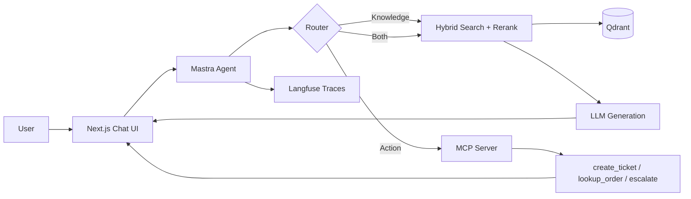

# Internal Knowledge Agent

A RAG-powered chat agent that answers questions from a company's internal docs **and** takes real actions (create ticket, look up order, escalate) via its own MCP server.

Built to demonstrate production-grade AI engineering: hybrid retrieval, reranking, citations, observability, and evals — not just a chatbot wrapper.

---

## What it does

Two capabilities, one agent:

| Capability | Input | Output |
|------------|-------|--------|
| **Knowledge** | "What's your refund policy?" | Streamed answer with citations to exact source docs |
| **Action** | "Create a ticket for my broken order #1234" | MCP tool call + visible result in chat |

The agent decides per message whether to retrieve, call a tool, or both.

---

## Architecture (high level)



---

## Tech stack

| Layer | Choice | Why |
|-------|--------|-----|
| Monorepo | Turborepo | Shared types across agent, ingestion, eval, apps |
| Frontend | Next.js (App Router) | Streaming UI, server actions |
| AI SDK | Vercel AI SDK | Streaming, tool calling, Zod structured outputs |
| Orchestration | Mastra | TypeScript-native, built-in MCP support |
| Vector DB | Qdrant | Hybrid search (BM25 + vector), self-hostable |
| Embeddings | Voyage `voyage-3` or OpenAI `text-embedding-3-large` | Strong retrieval benchmarks |
| Reranker | Voyage `rerank-2` | Critical differentiator most tutorials skip |
| Relational DB | PostgreSQL | Chat history, tickets, eval results |
| ORM | Prisma | Type-safe shared schema |
| Actions | Custom MCP server | Pluggable into any MCP client |
| Observability | Langfuse | End-to-end trace visibility |
| Evaluation | promptfoo | Retrieval + answer + tool-selection scoring |
| Deployment | Vercel (web) + Railway/Fly.io (MCP, Qdrant, Postgres) | No k8s required |

---

## Repository structure

```
knowledge-agent/
├── apps/
│   ├── web/                    # Next.js chat UI
│   └── mcp-server/             # Standalone MCP server
├── packages/
│   ├── agent/                  # Mastra agent + router + retrieval
│   ├── ingestion/              # Document pipeline
│   ├── eval/                   # promptfoo test suite
│   └── shared/                 # Zod schemas, Prisma client
├── docs/knowledge-agent/       # This documentation
└── .cursor/rules/              # Cursor AI guidance
```

---

## Build phases

| Phase | Focus | Exit criteria |
|-------|-------|---------------|
| [1 — Ingestion](./PHASES.md#phase-1--ingestion--retrieval-core) | Parse, chunk, embed, upsert | 5–10 manual queries return correct chunks |
| [2 — RAG pipeline](./PHASES.md#phase-2--rag-answer-pipeline) | Hybrid search, rerank, citations | Streamed answers with clickable citations |
| [3 — MCP + routing](./PHASES.md#phase-3--mcp-server--agent-routing) | Tools + router | Action questions trigger correct tool calls |
| [4 — Observability + evals](./PHASES.md#phase-4--observability--evaluation) | Langfuse + promptfoo | Traces exist; eval pass rate printed |
| [5 — Polish](./PHASES.md#phase-5--polish--documentation) | UI + docs + demo | 30–60s demo video |

See [PHASES.md](./PHASES.md) for step-by-step details.

---

## Documentation index

| Doc | Purpose |
|-----|---------|
| [README.md](./README.md) | You are here — overview, stack, phases |
| [ARCHITECTURE.md](./ARCHITECTURE.md) | Data flow, routing logic, design rationale |
| [SETUP.md](./SETUP.md) | Env vars, local dev, seeding Qdrant, running evals |
| [MCP_TOOLS.md](./MCP_TOOLS.md) | Tool schemas, examples, mock behavior |
| [EVAL.md](./EVAL.md) | Eval methodology, test cases, pass rate |
| [PHASES.md](./PHASES.md) | Build brief broken into actionable phases |
| [TECH_STACK.md](./TECH_STACK.md) | Why each technology was chosen |

---

## What "done" looks like

- [ ] Knowledge question → streamed answer with real, clickable citations
- [ ] Action question → correct MCP tool call visible in UI
- [ ] Langfuse trace for every chat turn (retrieval → rerank → tool → generation)
- [ ] `pnpm eval` runs promptfoo and prints pass rate
- [ ] All docs in this folder are accurate to what's built

---

## Why this project

- **MCP is the current standard** in the agent ecosystem — almost no portfolio projects have a real MCP server.
- **Mirrors production vertical AI** — docs in, structured answers and actions out (legal AI, support AI, workflow AI).
- **Depth is immediately visible** — retrieval quality, citation accuracy, eval pass rate, and trace visibility separate tutorial-followers from engineers.
