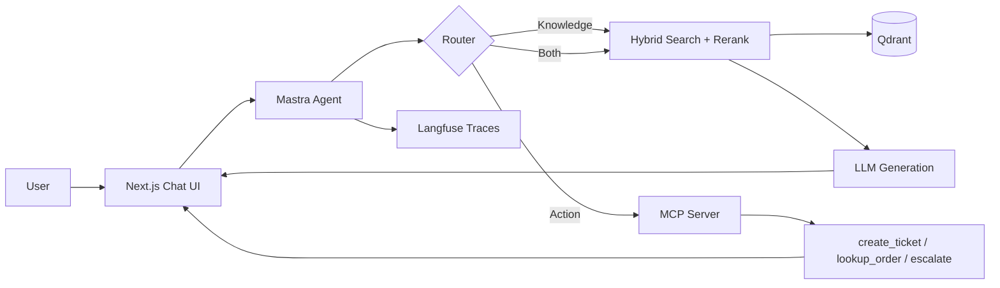

# Internal Knowledge Agent — Documentation

A RAG-powered chat agent that answers questions from internal docs **and** takes real actions via a custom MCP server.

**Start here:** [PROJECT_SPEC.md](./PROJECT_SPEC.md) — the full build brief for Cursor.

**Repo root:** [../../README.md](../../README.md) — main pitch, quickstart, current vs target structure.

---

## What it does

Two capabilities, one agent:

| Capability | Input | Output |
|------------|-------|--------|
| **Knowledge** | "What's your refund policy?" | Streamed answer with citations to exact source docs |
| **Action** | "Create a ticket for my broken order #1234" | MCP tool call + visible result in chat |

The agent decides per message whether to retrieve, call a tool, or both.

---

## Architecture (high level)

---

## Build phases

| Phase | Focus | Doc |
|-------|-------|-----|
| 1 | Ingestion + retrieval core | [PHASES.md#phase-1](./PHASES.md#phase-1--ingestion--retrieval-core) |
| 2 | RAG answer pipeline | [PHASES.md#phase-2](./PHASES.md#phase-2--rag-answer-pipeline) |
| 3 | MCP server + agent routing | [PHASES.md#phase-3](./PHASES.md#phase-3--mcp-server--agent-routing) |
| 4 | Observability + evals | [PHASES.md#phase-4](./PHASES.md#phase-4--observability--evaluation) |
| 5 | Polish + documentation | [PHASES.md#phase-5](./PHASES.md#phase-5--polish--documentation) |
| 6 *(later)* | Paid tier (Dodo Payments) | [PHASES.md#phase-6](./PHASES.md#phase-6--paid-tier-later) |

---

## Documentation index

| File | Purpose |
|------|---------|
| [PROJECT_SPEC.md](./PROJECT_SPEC.md) | **Build brief** — hand to Cursor; full spec |
| [README.md](./README.md) | Doc index (this file) |
| [ARCHITECTURE.md](./ARCHITECTURE.md) | Data flow, routing logic, design rationale |
| [PHASES.md](./PHASES.md) | Phase-by-phase tasks and verification gates |
| [SETUP.md](./SETUP.md) | Env vars, local dev, seeding Qdrant, running evals |
| [MCP_TOOLS.md](./MCP_TOOLS.md) | Tool schemas, examples, mock behavior |
| [EVAL.md](./EVAL.md) | Eval methodology, test cases, pass rate |
| [TECH_STACK.md](./TECH_STACK.md) | Why each technology was chosen |

Future (Phase 6 only): `BILLING.md` — Dodo Payments, plan gating, webhooks.

---

## Current implementation status

| Component | Status |
|-----------|--------|
| Turborepo monorepo | ✅ |
| `apps/frontend` (Next.js) | ✅ Auth UI scaffold — chat UI not built |
| `apps/api` (Express) | ✅ Stub + session middleware — not MCP yet |
| `packages/database` (Prisma) | ✅ Auth models — agent/chat models not added |
| Phase 1 ingestion | ❌ |
| Phase 2 RAG pipeline | ❌ |
| Phase 3 MCP server | ❌ |
| Phase 4 Langfuse + promptfoo | ❌ |
| Phase 5 polish + demo | ❌ |

---

## What "done" looks like

- [ ] Knowledge question → streamed answer with real, clickable citations
- [ ] Action question → correct MCP tool call visible in UI
- [ ] Langfuse trace for every chat turn (retrieval → rerank → tool → generation)
- [ ] `npm run eval` runs promptfoo and prints pass rate
- [ ] Five markdown docs accurate to what's built
- [ ] 30–60 second demo video

---

## Why this project

- **MCP is the current standard** — almost no portfolio projects have a real MCP server.
- **Mirrors production vertical AI** — docs in, structured answers and actions out.
- **Depth is immediately visible** — retrieval quality, citation accuracy, eval pass rate, trace visibility.
